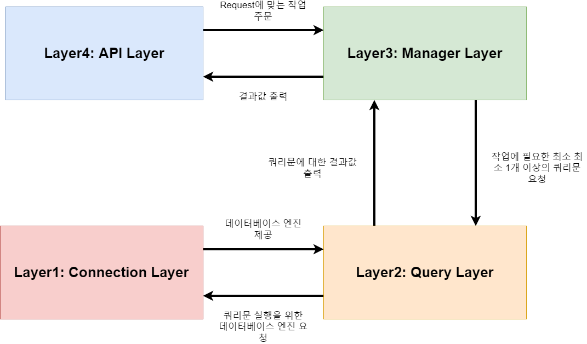
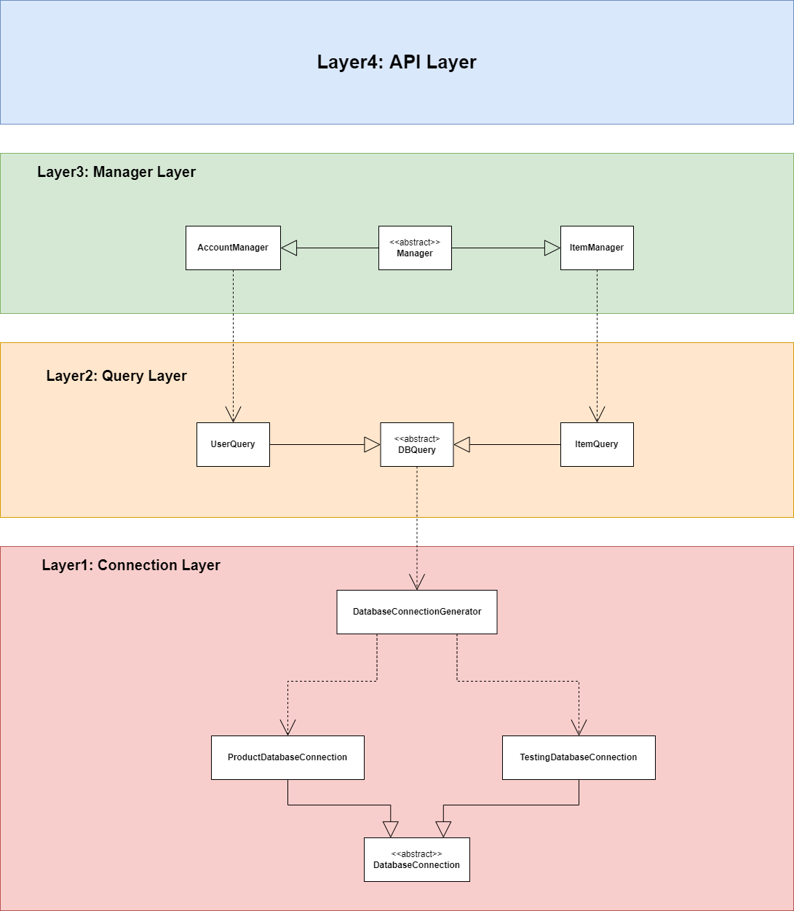
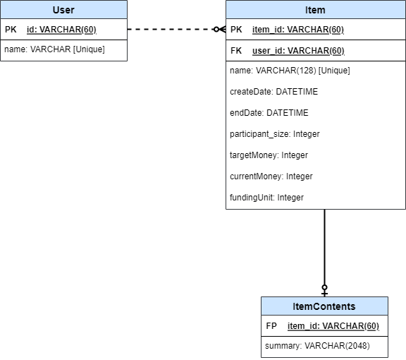

# 원티드 프리온보딩 코스
원티드 프리 온보딩 선발 과제
<br>
과제 수행 기간: 04월 15일 ~  04월 17일

## 개요
* 크라우드 펀딩 기능을 지원하는 API 시스템 입니다.
* 게시자는 상품을 게시/수정/상세조회/삭제를 할 수 있습니다.
* 또한 일부 문자열 패턴을 이용해 게시물을 검색하겨나, 특정 기준으로(펀딩 금액, 생성 날짜 기준) 정렬한 리스트를 얻을 수 있습니다.

## 요구 사항 분석
* **상품 등록** 
  * 제목, 유저 이름, 상품 설명, 목표 금액, 펀딩 종료일, 1회 펀딩 금액으로 구성됩니다.
  * **제목**: 지나치게 길지 않게 128자로 제한했습니다.
  * **상품 설명**: 상품 설명 역시 지나치게 길지 않게 2048자로 제한했습니다.
  * **목표 금액**: 음수의 가격을 펀딩하는 것은 있을 수 없는 일입니다. 0또는 양수의 정수만 가능합니다.
  * **펀딩 종료일**: **날짜 제한을 두지 않았습니다.** 과거에 있었던 상품을 다시 백업하는 경우도 있기 때문입니다.
  * **1회 펀딩 금액**: 0원을 후원하는 건 의미가 없으므로 1회 펀딩 금액은 무조건 **1원 이상**이어야 합니다.
* **상품 수정**
  * 목표 금액을 제외한 나머지 항목은 전부 수정 가능합니다. 단 상품 등록에 있는 항목 말고도 추가 제한이 있습니다.
  * **참가자 수**: 참가자 수가 음수가 되는 경우는 없으므로 0이상이어야 합니다.
  * **현재 펀딩 금액**: 목표 금액과 동일합니다. 0이상의 정수가 들어갑니다.
  * 단, 게시자 변경은 상품 수정이 아닌 사용자 정보 수정을 이용해 변경이 가능합니다.
* **상품 삭제**
  * 말 그대로 상품을 삭제합니다. 삭제 버튼을 누르면 해당 상품의 모든 정보가 DB에서 제거됩니다.
* **상품 목록**
  * 제목,게시자 이름,총 펀딩 금액, 달성률, D-Day를 출력합니다.
    * D-Day의 경우, 종료 이전이면 **음수**, 종료 이후이면 **양수**를 출력합니다.
    * 달성률의 경우, 소수점을 버림한 값을 출력합니다.
* **상품 상세 페이지**
  * 제목, 게시자명, 총펀딩금액, 달성률, D-Day, 목표 금액, 참여자 수를 출력합니다.

## 개발 환경
* OS: Windows10(Backend), Ubuntu(Docker, MySQL)
* Backend Framework: Python/Flask
* Database
  * Engine: Mysql(For Production), SQLite(For Testing)
  * Framework: SQLAlchemy(ORM)
* Editor
  * Pycharm

## 시스템 구성

### Archithecure



시스템 구성도는 위와 같이 크게 4개의 레이어로 구성되어 있습니다.

#### API Layer
API Layer는 최상단에 있는 Layer로 외부로부터 Http Request를 직접 받은 다음, 요청에 맞는 작업들을 Manager Layer에 주문합니다. Manager Layer로부터 나온 결과들을 필요하면 가공하여 클라이언트에게  son 형태로 전달합니다.

#### Manager Layer
API Layer로부터 주문을 받으면 해당 주문에 대한 쿼리 작업을 한 다음 이들을 취합해서 반환을 해 줘야 합니다. 이 때 쿼리 작업을 Query Layer에 요청한 다음 이에 대한 결과값들을 활용합니다. 여기까지가 외부 리소스에 직접 접근을 하지 않기 때문에 **High Layer**로 분류 됩니다.

#### Query Layer
Layer2 부터는 외부 리소스에 직접 접근을 하기 시작합니다. 따라서 이 부분 부터 **Low Layer**로 분류 됩니다. Query Layer는 직접 Database로 Query문을 실행해서 이에 대한 결과 값들을 Manager Layer로 전달합니다.

#### Connection Layer

최하단 층인 Connection Layer는 Query Layer가 DB에 접근 할 수 있게, 또는 외부 리소스에 접근할 수 있게 엔진이나 모듈 등을 제공합니다.

#### 장점

하나의 서버가 총 4개의 Layer로 나뉘어서 작동을 하고 있습니다. 각자 서로의 영역을 침범하지 않고 자신이 할 일만 하기 때문에 어느 한 쪽의 상태가 바뀌었다고 해서(데이터베이스 연결이 안되는 등의 비상적인 경우는 제외) 다른 쪽의 상태가 비정상적으로 바뀌진 않습니다. 이를 바탕으로 아래의 Class Diagram을 설계했습니다.

### Class Diagram


* Layer 1
  * DatabaseConnection: 데이터베이스 엔진을 작접 생성 또는 관리합니다.
    * ProductDatabaseConnection: 배포용 데이터베이스 엔진 입니다.
    * TestingDatabaseConnection: unittest용 데이터베이스 엔진 입니다.
  * **DatabaseConnectionGenerator**: 데이터베이스 엔진을 불러옵니다. 즉 DatabaseConnection객체 또는 해당 객체의 멤버 변수 일부를 호출합니다. 따라서 Query Layer는 DB에 접근할 때 DatabaseConnection을 직접 생성하는 것이 아닌 ProductionDatabaseGenerator를 이용해 Connection을 호출합니다.
* Layer 2
  * DBQuery: Query문을 수행할 때 사용되는 객체
* Layer 3
  * Manager: DBQuery를 활용해 API로부터의 작업을 수행합니다.
* **특징**
  * 보다시피 상대 클래스를 멤버 변수로 사용하는 연관 관계(실선)이 없고, 단지 지역변수 로만 사용하는 의존 관계(점선)만 있습니다. **즉, 서로 멤버 변수로 잡고 있지 않으며 서로 독립적 입니다.**

### Database


상품(Item) 에서 기존 정보와 설명란이 들어가 있는 ItemContents를 분리했습니다. 설명란의 경우 데이터가 길어질 수 있기 때문에 위와 같이 분리를 해두면, 상품 정렬 또는 리스트 검색을 할 때 ItemContents에 있는 항목을 접근할 필요가 없기 때문에 성능이 향상됩니다. 비록 현재 Contents에는 길이가 2048자 인 summary 하나라서 별 차이는 없지만, 데이터가 많아지고 ItemContents에도 그림 파일 등 여러 컬럼들이 추가될 수록 그 효과는 더 커진다고 생각합니다.

### 설계 전략

#### 외부 리소스를 관리하는 엔진은 반드시 하나만 생성되어야 한다. (Singletone Pattern)

Layer1인 Connection Layer는 하나의 인스턴스만 생성되게 프로그래밍 되어 있습니다. Connection Instance의 남발로 인한 과부화를 줄이기 위해 해당 객체를 생성 시, 기존에 생성되어 있는 Instance를 가져올 수 있게 **Singletone Pattern**으로 구현하였습니다.

``` python
class TestingDatabaseConnection(DatabaseConnection):
    """ 테스팅용 데이터베이스 커넥션
        오로지 unittest에서만 사용해야 하며 배포용으로는 사용 금지
    """

    __state = {"engine": None, "session": None}

    def __init__(self, *args):
        # __state에서 기존의 엔진 가져오기
        # 이걸로 여러개 생성해도 실제 DB 커넥션은 단 하나만 생성된다.
        self.__dict__ = self.__state

    def connect(self):
      if not self.engine:
        # engine이 없는 경우 -> connection을 활성화하지 않음
        # test.db 파일을 이용한 테스팅
        self.engine = create_engine("sqlite:///test.db")
        self.session = scoped_session(sessionmaker(autocommit=False, autoflush=False, bind=self.engine))
```

Connection Layer 뿐만 아니라 Manager Layer도 수많은 요청에 따라 인스턴스 남발을 줄이기 위해 마찬가지로 하나의 인스턴스만 실행할 수 있게 Singletone Pattern으로 구현되었습니다.
```python
class ItemManager(Manager):

    def __new__(cls, *args, **kwargs):
        # 하나의 서버에 하나의 객체만 있어야 하기 때문에 Singletone Pattern 도입
        if not hasattr(cls, 'item_manager_instance'):
            cls.item_manager_instance = super(ItemManager, cls).__new__(cls)
        return cls.item_manager_instance
```

#### 작동 상태(unittest, deploy)가 달라도 코드는 그대로 (Factory Pattern)

이 프로젝트에서는 배포용으로 MySQL, 테스트용으로는 SQLite을 사용합니다. ORM의 도움 덕분에 Low하게 SQLite, MySQL 모듈을 직접 사용할 일이 없지만, 그래도 DB Engine을 관리함에 있어 코드에 차이가 있습니다. 그렇다고 매 DB가 필요할 때마다 if문을 이용해서 테스트, 배포용 코드를 작성하면 코드가 꼬이기 때문에 이를 방지하는 DatabaseConnectionGenerator 클래스를 따로 작성하게 되었습니다.

```python
class DatabaseConnectionGenerator:
    """ 데이터베이스 커넥션 생성기
        직접 DBConnection을 생성하는 것이 아닌
        해당 클래스의 메소드를 통해 Connection을 관리한다.
    """
    ... 생략 ...

    @staticmethod
    def get_engine() -> sqlalchemy.engine.base.Engine:
        """ 엔진 호출 """
        if 'unittest' in sys.modules:
            # 테스트용
            return TestingDatabaseConnection().get_engine()
        else:
            # 배포용
            return ProductionDatabaseConnection().get_engine()
```

팩토리 패턴은 다른 클래스의 객체를 생성하는 클래스를 따로 만듦으로써, 객체 간의 의존도를 줄이는 방법 입니다. get_engine()에서 테스트/배포 여부를 판단하여 그에 맞는 엔진을 호출하기 때문에 Query단에서는 분기점 없이 get_engine()만 사용하면 됩니다.
```python
    @staticmethod
    def delete(key: str, value: str) -> ItemQueryErrorCode:
        """ 상품 삭제 """

        # get_session()이 테스트/배포 모드를 구별해서 이에 맞는 엔진을 호출한다
        db_session = DatabaseConnectionGenerator.get_session()
        deleted_item: Item = None

        """ 아이템 삭제 """
        if key == "id":
            # 아이디를 이용한 삭제
            deleted_item = db_session.query(Item).filter(Item.item_id == value).scalar()
        elif key == "name":
            # 상풍명을 이용한 삭제
            deleted_item = db_session.query(Item).filter(Item.name == value).scalar()
        ... 생략 ...
```


#### 각 객체는 최대한 서로에 의존하면 안된다 (낮은 결합도)

Class Diagram에서도 서술 했지만 최소한 여기에 있는 클래스들은 다른 클래스를 멤버 변수로 잡지 않습니다. Connection Layer는 인스턴스가 Singletone Pattern으로 인해 단 하나의 인스턴스가 전역변수로 생성되어 있고, Query Layer는 Connection을 멤버 변수로 잡을 필요도 없이 Generator 함수로 받아오기만 하면 되며, Query를 사용하는 Manager Layer들은 Query의 static method만 불러와서 사용하면 됩니다.


## 디렉토리 구성
project 디렉토리의 구성도는 다음과 같습니다.
* apis: API Layer, 즉 http request를 받는 API Function들이 작성되어 있습니다.
* configs: 배포 시, 연걸할 MySQL의 정보를 담고 있습니다.
* connection: Connection Layer의 클래스들이 작성되어 있습니다.
* manager: Manager Layer의 클래스들이 작성되어 있습니다.
* model: RDB Model과 Validator가 있습니다.
* query: Query Layer의 클래스들이 작성되어 있습니다.
* test: Test Code 입니다.

## 실행 방법 (CLI 기준)
* 공통
  1. requirements.txt로 필요한 패키지들을 설치합니다.
  2. project 폴더로 이동합니다.
* 테스팅
  2. ```python -m unittest``` 를 입력합니다.
* 배포(Production)
  * configs/config.json에서 데이터베이스 환경을 수정합니다.
  * ```python app.py``` 를 입력합니다.

## API Document

### 유저 관련
|uri|설명|
|---|---|
|/user/{str:username}|사용자 관련  API|

* get
  * 설명: 사용자의 아이디와 이름을 출력
  * output
    ```json
    {
      "result": <성공 여부>,
      "data": {
        "name": <name>,
        "id": <유저 고유 아이디>
      }
    }
    ```
* post
  * username으로 새로운 사용자 생성
  * output
    ```json
    {"result": <성공 여부>}
    ```
* put
  * 기존 사용자의 이름을 변경
  * input
    ```json
    {"name": <변경 할 이름>}
    ```
  * output
    ```json
    {"result": <성공 여부>}
    ```

### 상품 정보 관련
|uri|설명|
|---|---|
|/item/{str:item_name}|상품 관련  API|

* get
  * 설명: 상품의 상세 정보를 출력
  * output
    ```json
    {
      "result": <성공 여부>,
      "data": {
        "user_name": <게시자 이름>,
        "summary": <상품 설명>,
        "end_date": <마감 날짜: Foramt(YYYY/MM/DD HH:MM:SS)>,
        "funding_unit": <1회 펀딩 당 금액>,
        "target_money": <목표 금액>,
        "current_money": <현재 펀딩된 금액>,
        "participant_size": <현재 참가자 수>,
        "funding_gage": <달성률>,
        "item_name": <상품 이름>
      }
    }
    ```
* post
  * item_name으로 새로운 상품 등록
  * input
    ```json
    {
      "user_name": <게시자 이름>,
      "summary": <상품 설명>,
      "end_date": <마감 날짜: Foramt(YYYY/MM/DD HH:MM:SS)>,
      "funding_unit": <1회 펀딩 당 금액>,
      "target_money": <목표 금액>,
      "item_name": <상품 이름>
    }
    ```
  * output
    ```json
    {"result": <성공 여부>}
    ```
* put
  * 기존 상품의 정보를 변경
  * input
    ```json
    {
      "summary": <상품 설명>,
      "end_date": <마감 날짜: Foramt(YYYY/MM/DD HH:MM:SS)>,
      "funding_unit": <1회 펀딩 당 금액>,
      "current_money": <현재 펀딩된 금액>,
      "participant_size": <현재 참가자 수>,
      "funding_gage": <달성률>,
      "name": <상품 이름>
    }
    ```
  * output
    ```json
    {"result": <성공 여부>}
    ```

### 상품 후원 관련
|uri|설명|method|
|---|---|---|
|/item/{str:item_name}/donate|후원 버튼으로 1번 펀딩을 할 수 있습니다|PUT|

* output
  ```json
    {"result": <성공 여부>}
  ```

### 상품 리스트 관련
|uri|설명|method|args|
|---|---|---|---|
|/item/list|문자열 패턴으로 상품 리스트를 구합니다.|GET|search=문자열
|/item/list|펀딩금액 또는 생성일 기준으로 정렬합니다.|GET|order_by="총펀딩금액" or "생성일"|

* output
  ```json
  {
    "result": <성공 여부>
    "data": [<상품 목록>]
  }
  ```
  * 상품 목록
  ```json
  {
    "user_name": <게시자 이름>,
    "current_money": <현재 금액>,
    "percentage": <달성률>,
    "item_name": <상품 이름>,
    "d-day": <d-day(마감 전: 음수, 마감 후: 양수)>
  }
  ```